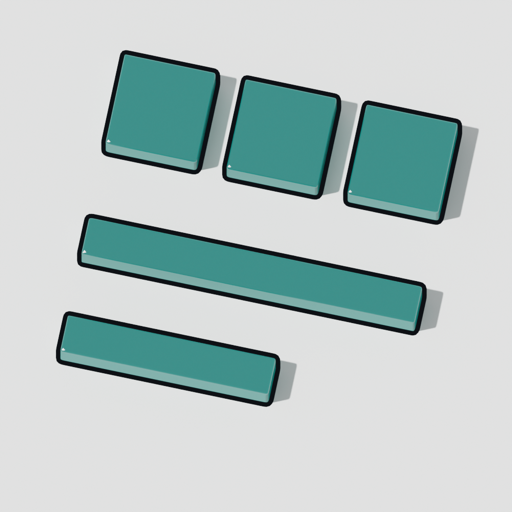

<!-- brand:logo -->


# design-system

<!-- catalog:header — generated by `pub catalog render`; do not edit by hand -->
**Ring:** platform · **Layers:** L10 · **Wave:** 1 · **Tier:** incubating

Tokens, type scale, icons, motion, shortcut map, command palette spec — the one look and feel.

Planned components: tokens (JSON+Rust) · icon set · shortcut registry · theme engine
<!-- catalog:end -->

## In 30 seconds

```rust
use pub_design_system_tokens::{Path, TokenSet, Value, suite};

let set = suite::tokens();                                   // the suite's colours and spacing
let primary = set.resolve(&Path::parse("color.action.primary")?)?;
assert_eq!(primary, &Value::Color(suite::color::ACCENT_500));
assert_eq!(TokenSet::from_json_str(&set.to_json_string())?, set); // the DTCG file, and back
```

## What it does

- `pub-design-system-tokens`: the design tokens as typed Rust and as the W3C Design Tokens (DTCG) JSON
  interchange, Format Module 2025.10 with its Color Module. A strict reader (colour and dimension, `$type`
  inheritance, metadata, `{group.token}` aliases, every error with its path), a canonical writer
  (`import(export(set)) == set`), alias resolution with cycle and type-mismatch detection, and the suite's own
  set: a palette in sRGB with hex fallbacks, the roles that alias into it, a quarter-rem spacing scale;
  `crates/pub-design-system-tokens/tokens/suite.tokens.json` is the export every non-Rust tool reads.

## What it does not do (yet)

- The other token types (`fontFamily`, `fontWeight`, `duration`, `cubicBezier`, `number`, the composites),
  `$extends` and JSON-Pointer `$ref` references: read as errors until they land.
- The type scale, radii, motion durations and elevation tokens; the icon set, the shortcut registry and the theme
  engine: the other planned components.

## Status

| Ledger entry | Readiness | Next |
|---|---|---|
| tokens (`pub-design-system-tokens`) | partial: colour and spacing, the DTCG round trip | the type scale, radii and motion tokens; `ui` reads `suite::tokens()` |

## How it fits the suite

Implements: _none yet_ · Requires: _none yet_ (see `CATALOG.toml`)

## Contributing

`pub check` must pass. See the org-wide [CONTRIBUTING](https://github.com/public-software/.github/blob/main/CONTRIBUTING.md) and `PROVENANCE.md`.

## Provenance

See `PROVENANCE.md`.
